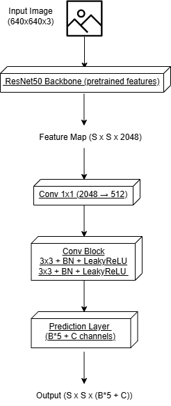

# Traffic Sign Detection using ResNet trained with synthetic data

##  Overview

This project implements a **traffic sign detection and classification system** using a custom architecture inspired by YOLO, with a **ResNet-50 backbone**.

Unlike traditional YOLO models, this implementation:

* Uses **ResNet-50** for feature extraction
* Implements a **grid-based detection head**
* Performs **both localization (bounding boxes) and classification**
  
The model is trained on a mix of:

* Synthetic data (generated using augmentation & compositing)
* Real-world datasets (GTSRB + GTSDB)

---

## Features

* Custom YOLO-style detection pipeline
* ResNet-50 backbone (transfer learning)
* Synthetic dataset generation
* mAP and accuracy evaluation
* Visualization of predictions
* Video inference support (frame-by-frame detection)

---

## Model Architecture

```

```

Where:

* `S x S` → grid size
* `B` → number of bounding boxes per cell
* `C` → number of classes (43 traffic signs)

---

## Metrics

Example performance:

* **mAP:** 0.975
* **Accuracy:** 97.64%

---

## Installation

```bash
git clone https://github.com/YOUR_USERNAME/YOUR_REPO.git
cd YOUR_REPO

pip install -r requirements.txt
```

---

## Dataset Generation

This project generates synthetic data by:

* Applying augmentations (blur, brightness, perspective)
* Pasting traffic signs onto real backgrounds

Run:

```bash
python generate_dataset.py \
  --roboflow_api_key YOUR_KEY \
  --kaggle_username YOUR_USERNAME \
  --kaggle_key YOUR_KEY
```

---

## Training

```bash
python Scripts/train.py \
  --dataset_path Dataset \
  --epochs 50 \
  --batch_size 8
```

---

## Testing

```bash
python Scripts/test.py \
  --checkpoint_path path/to/model.pth \
  --dataset_path Dataset
```

This will output:

* mAP
* Accuracy
* JSON report
* Visual predictions in `visual_results/`

---

## Video Inference

### Step 1: Extract frames

```bash
ffmpeg -i input.mp4 frames/frame_%05d.jpg
```

### Step 2: Run detection

```bash
python Scripts/video_inference.py \
  --frames_dir frames \
  --output_dir output_frames \
  --checkpoint_path model.pth
```

### Step 3: Convert back to video

```bash
ffmpeg -framerate 30 -i output_frames/frame_%05d.jpg \
-c:v libx264 -pix_fmt yuv420p output.mp4
```

---

## Important Notes

### Preprocessing Consistency

Make sure inference preprocessing matches training:

* Resize to 640x640
* Normalize correctly (if used during training)

### Synthetic vs Real Data Gap

If detection fails on real images:

* Domain gap may exist
* Improve with:

  * More real data
  * Better augmentation
  * Anchor boxes

---
## References

* YOLO (You Only Look Once)
* ResNet (He et al., 2015)
* GTSRB Dataset
* GTSDB Dataset

---
